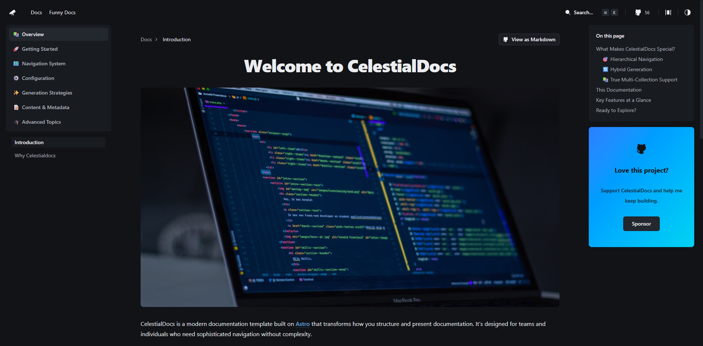

<div align="center">

# CelestialDocs

**The Only Documentation System You'll Ever Need**

[**Read Documentation**](https://celestialdocs.hyperoot.dev)

</div>



## 🔓 Unlock True Freedom

CelestialDocs isn't just another documentation tool - it's a **complete foundation** for your digital presence. Unlike rigid NPM packages that hide their logic, CelestialDocs gives you **full control** over every line of code.

### 🚀 Why It's A Game Changer

**You Own The Source Code**
No hidden logic. No black-box NPM packages. You clone the repo, and it's yours. Modify the build, add custom integrations, or rewrite the core logic. You aren't "using" CelestialDocs; you're building *on top of it*.

**One Umbrella, Infinite Possibilities**
Why manage separate repos for your Docs, Blog, and Portfolio? With our multi-collection architecture, you can build everything in one place.
- **Docs?** `/docs`
- **Blog?** `/blog`
- **Product?** `/product`
*All sharing the same high-performance foundation.*

**Framework Agnostic Power**
Powered by **Astro**, you're never locked in. We use React for UI, but you can drop in **Vue, Svelte, Solid, or Vanilla JS** components anywhere. Use the right tool for the job, every time.

**Design System Ready**
Built on **Tailwind CSS 4** and **Shadcn UI**, your project looks professional from day one. Use any SVG icon (we love SVGRepo!) without complex setups. It's homogenous, accessible, and beautiful by default.

## ✨ Designed for Everyone

**For Developers**
Configure once in `data/config.ts`. The type-safe architecture catches errors before they happen. You handle the code; the system handles the rest.

**For Writers & Non-Techies**
Forget complex Git workflows. Just go to the `content/` folder, drop in a Markdown file, and start typing. The system automatically creates routes, navigation, and search indexes for you.

## 🚀 Quick Start

```bash
git clone https://github.com/HYP3R00T/CelestialDocs.git my-docs
cd my-docs
pnpm install && pnpm dev
```

Visit `http://localhost:4321` to see your new platform.

## 🤝 Contributing

We believe in open source. Fork the repo, make it better, and own your improvements.

## ❤️ Support

If this project saves you time or helps you build something amazing, please consider supporting the work:

[](https://github.com/sponsors/HYP3R00T)

---

<div align="center">

**Built with ❤️ by [@HYP3R00T](https://github.com/HYP3R00T)**

</div>
