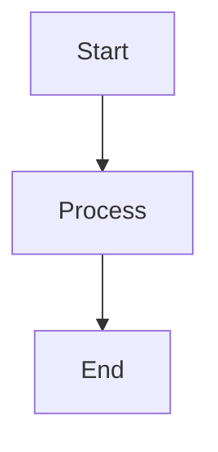

CelestialDocs supports both Markdown and MDX for writing documentation. Use Markdown for straightforward content and MDX when you need interactive components or custom layouts.

## Markdown Basics

Markdown is a lightweight markup language that's easy to read and write. If you've used GitHub, Reddit, or Discord, you've probably used Markdown before.

### Headings

Create headings with `#` symbols:

```markdown
# Heading 1
## Heading 2
### Heading 3
#### Heading 4
```

**Best practice**: Use only one H1 (`#`) per page - it should match your frontmatter title.

### Text Formatting

Make text **bold**, *italic*, or ***both***:

```markdown
**bold text**
*italic text*
***bold and italic***
~~strikethrough~~
```

### Lists

Create unordered lists with `-`, `*`, or `+`:

```markdown
- First item
- Second item
- Third item
  - Nested item
  - Another nested item
```

Create ordered lists with numbers:

```markdown
1. First step
2. Second step
3. Third step
```

### Links

Link to other pages or external sites:

```markdown
[Link text](https://example.com)
[Internal link](/docs/getting-started)
[Relative link](./frontmatter)
```

### Code

Inline code uses backticks: `const x = 42`

Code blocks use triple backticks with a language:

````markdown
```typescript
function greet(name: string): string {
  return `Hello, ${name}!`;
}
```
````

Supported languages include: `typescript`, `javascript`, `python`, `bash`, `json`, `yaml`, `markdown`, and many more.

### Blockquotes

Create callouts or quotes:

```markdown
> This is a blockquote.
> It can span multiple lines.
```

### Tables

Create tables with pipes and hyphens:

```markdown
| Feature | Supported |
|---------|-----------|
| Markdown | ✅ |
| MDX | ✅ |
| HTML | ✅ |
```

### Images

Embed images:

```markdown


```

### Horizontal Rules

Create dividers:

```markdown
---
```

## MDX: Markdown + Components

MDX extends Markdown by allowing you to use JSX components directly in your content. This enables interactive elements, custom layouts, and reusable content blocks.

### What is MDX?

MDX is Markdown with superpowers. You can:

- Import and use React/Astro components
- Pass props to components
- Use JavaScript expressions
- Create interactive documentation

### When to Use MDX

Use MDX when you need:

- **Interactive examples** - Live code demos, toggles, tabs
- **Custom layouts** - Special formatting for specific pages
- **Reusable components** - Callouts, warnings, tips
- **Dynamic content** - Content that changes based on props or state

Use regular Markdown when:

- Writing straightforward documentation
- You don't need custom components
- You want to keep things simple

### Basic MDX Example

Create a file with `.mdx` extension:

```mdx
---
title: "MDX Example"
description: "Demonstrating MDX capabilities"
---

import { Alert } from '@/components/Alert';

# MDX Example

Regular Markdown content works here.

<Alert type="info">
  This is a custom component!
</Alert>

You can mix Markdown and components seamlessly.
```

### Using Components

Import components at the top of your MDX file:

```mdx
---
title: "Component Demo"
description: "Using custom components"
---

import { Tabs } from '@/components/Tabs';
import { CodeBlock } from '@/components/CodeBlock';

# Component Demo

<Tabs>
  <Tab label="JavaScript">
    ```javascript
    console.log('Hello!');
    ```
  </Tab>
  <Tab label="TypeScript">
    ```typescript
    console.log('Hello!' as string);
    ```
  </Tab>
</Tabs>
```

### Passing Props

Components can accept props:

```mdx
<Alert type="warning" title="Important">
  Make sure to read this carefully!
</Alert>

<CodeBlock
  language="typescript"
  showLineNumbers={true}
  highlightLines={[2, 3]}
>
  {`function example() {
    const x = 42;
    return x * 2;
  }`}
</CodeBlock>
```

### JavaScript Expressions

Use curly braces for JavaScript expressions:

```mdx
export const version = "2.0.0";

# Documentation for Version {version}

The current year is {new Date().getFullYear()}.

{/* This is a comment in MDX */}
```

### Conditional Content

Show content conditionally:

```mdx
export const isAdvanced = true;

# Getting Started

Basic content here...

{isAdvanced && (
  <Alert type="info">
    Advanced features are enabled!
  </Alert>
)}
```

## Choosing Between Markdown and MDX

### Use Markdown (.md) for

- ✅ Simple documentation pages
- ✅ Getting started guides
- ✅ Reference documentation
- ✅ FAQ pages
- ✅ Changelog entries

### Use MDX (.mdx) for

- ✅ Interactive tutorials
- ✅ Component documentation
- ✅ Pages with custom layouts
- ✅ Content with special formatting
- ✅ Dynamic or conditional content

### Performance Consideration

Markdown files are slightly faster to build than MDX files. For large documentation sites, prefer Markdown unless you specifically need MDX features.

## Common Patterns

### Callout Boxes

Create attention-grabbing callouts:

```markdown
> **💡 Tip**: Use auto-generated navigation for large sections!

> **⚠️ Warning**: This will delete all your content!

> **ℹ️ Note**: This feature requires Astro 4.0 or higher.
```

### Step-by-Step Instructions

Number your steps clearly:

```markdown
## Installation Steps

1. **Clone the repository**
   ```bash
   git clone https://github.com/user/repo.git
   ```

1. **Install dependencies**

   ```bash
   npm install
   ```

2. **Start the dev server**

   ```bash
   npm run dev
   ```

```

### Code with Explanations

Explain code blocks:

```markdown
Here's how to configure a new collection:

```typescript
export const CONTENT: ContentConfig = {
    systems: [
        {
            id: "docs",              // Unique identifier
            dir: "content/docs",     // Content directory
            route: "/docs",          // URL prefix
        }
    ],
};
```

Each field serves a specific purpose...

```

### Keyboard Shortcuts

Document keyboard shortcuts:

```markdown
Press `Ctrl` + `K` to open search.
Use `Cmd` + `S` to save (Mac) or `Ctrl` + `S` (Windows).
```

## Markdown Extensions

CelestialDocs supports several Markdown extensions:

### GitHub Flavored Markdown (GFM)

- Task lists: `- [ ] Todo item`
- Strikethrough: `~~deleted text~~`
- Tables with alignment
- Autolinked URLs

### Syntax Highlighting

Code blocks automatically get syntax highlighting based on the language tag.

### Mermaid Diagrams

Create diagrams with Mermaid syntax:

````markdown

````

## Best Practices

### Keep It Simple

Start with Markdown. Only use MDX when you need its features.

### Use Semantic Headings

Structure your content with proper heading hierarchy:

```markdown
# Page Title (H1 - only one per page)
## Main Section (H2)
### Subsection (H3)
#### Detail (H4)
```

### Write Descriptive Links

Instead of "click here", use descriptive text:

```markdown
❌ [Click here](./installation) to install
✅ Check out the [installation guide](./installation)
```

### Add Alt Text to Images

Always include descriptive alt text:

```markdown

```

### Use Code Blocks Generously

Show, don't just tell. Include code examples:

```markdown
To add a new page, create a file with frontmatter:

```markdown
---
title: "My Page"
description: "Page description"
---

# My Page

Content here...
```

```

### Break Up Long Content

Use headings, lists, and whitespace to make content scannable.

## What's Next?

Now that you understand Markdown and MDX:

- Learn about [Frontmatter](frontmatter) to add metadata to your pages
- Explore [Custom Components](/docs/advanced/custom-components) to create reusable MDX components
- Check out the [Navigation System](navigation-system) to organize your content
