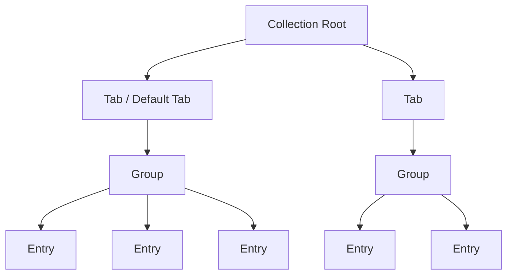

CelestialDocs features a powerful, flexible navigation system that scales from simple documentation to complex multi-section sites. Understanding the hierarchy of entries, groups, and tabs is key to organizing your content effectively.

## Navigation Hierarchy

The navigation system has three levels:



### The Three Levels

1. **Entries** - Individual documentation pages (files)
2. **Groups** - Collections of related entries (sections)
3. **Tabs** - Top-level navigation contexts (major divisions)

Let's explore each level in detail.

## Entries

An **entry** is a single documentation page - one Markdown or MDX file.

### What is an Entry?

- A single `.md` or `.mdx` file in your content directory
- Represents one page of documentation
- Has its own URL route
- Appears as a link in the sidebar

### Entry Example

File: `content/docs/getting-started/installation.md`

```markdown
---
title: "Installation"
description: "How to install CelestialDocs"
---

# Installation

Installation instructions here...
```

This creates an entry that:

- Appears in the sidebar as "Installation"
- Is accessible at `/docs/getting-started/installation`
- Belongs to the `getting-started` group

### Entry Properties

Entries can be customized via:

**Frontmatter:**

- `title` - Page title
- `navLabel` - Override sidebar text
- `navIcon` - Add an icon
- `navHidden` - Hide from navigation

**Configuration:**

- Explicit slug in `SIDEBAR_NAVIGATION`
- Custom label override
- Custom icon override

## Groups

A **group** is a collection of related entries that appear together in the sidebar.

### What is a Group?

- A section in the sidebar containing multiple entries
- Can be collapsible or always expanded
- Can have an icon and label
- Can be manually configured or auto-generated

### Group Types

CelestialDocs supports three types of groups:

#### 1. Manual Groups

Explicitly list every entry in order:

```typescript
{
    id: "getting-started",
    label: "Getting Started",
    icon: "🚀",
    entries: [
        { slug: "getting-started/index" },
        { slug: "getting-started/installation" },
        { slug: "getting-started/quick-start" },
        { slug: "getting-started/first-page" },
    ],
}
```

**When to use:**

- Content needs specific ordering
- Curated selection of pages
- Small, focused sections

#### 2. Auto-Generated Groups

Automatically discover all files in a folder:

```typescript
{
    id: "features",
    label: "Features",
    icon: "✨",
    autoGenerated: true,
}
```

**When to use:**

- Large sections with many pages
- Alphabetical ordering is acceptable
- Content changes frequently

#### 3. Hybrid Groups

Mix manual entries with auto-generation:

```typescript
{
    id: "guides",
    label: "Guides",
    icon: "📖",
    entries: [
        { slug: "guides/overview" },  // Manual entry first
    ],
    autoGenerated: true,  // Then auto-discover rest
}
```

**When to use:**

- Want a specific page first
- Rest can be auto-discovered
- Balance control and convenience

### Group Configuration

Groups are configured in `data/config.ts`:

```typescript
export const SIDEBAR_NAVIGATION: SidebarNavigation = {
    docs: {
        defaultTab: {
            label: "Documentation",
            icon: "document",
        },
        groups: [
            {
                id: "getting-started",      // Unique identifier
                label: "Getting Started",   // Display name
                icon: "🚀",                 // Emoji or SVG
                entries: [                  // Manual entries
                    { slug: "getting-started/index" },
                ],
            },
            {
                id: "features",
                label: "Features",
                icon: "✨",
                autoGenerated: true,        // Auto-discover
            },
        ],
    },
};
```

### Group Properties

- **id** (required) - Unique identifier, should match folder name
- **label** (required) - Display name in sidebar
- **icon** (optional) - Emoji or SVG reference
- **entries** (optional) - Array of manual entries
- **autoGenerated** (optional) - Enable auto-discovery
- **tab** (optional) - Make this group a tab-level group

## Tabs

A **tab** is a top-level navigation context that can contain multiple groups.

### What is a Tab?

- A major division in your documentation
- Appears as a tab in the navigation
- Can contain multiple groups
- Provides a separate navigation context

### Default Tab vs Custom Tabs

Every collection has a **default tab** that contains regular groups:

```typescript
docs: {
    defaultTab: {
        label: "Documentation",
        icon: "document",
    },
    groups: [
        // These groups appear in the default tab
        { id: "getting-started", label: "Getting Started", icon: "🚀" },
        { id: "core-concepts", label: "Core Concepts", icon: "💡" },
    ],
}
```

You can also create **custom tabs** by setting `tab: true` on a group:

```typescript
groups: [
    // Regular groups (in default tab)
    { id: "getting-started", label: "Getting Started", icon: "🚀" },

    // Tab-level group
    {
        id: "patterns",
        label: "Common Patterns",
        icon: "🎯",
        tab: true,              // This creates a new tab
        autoGenerated: true,
    },
]
```

### When to Use Tabs

Use tabs to separate:

- **Different audiences** - Users vs Developers
- **Different content types** - Guides vs API Reference
- **Different purposes** - Documentation vs Examples
- **Major sections** - Getting Started vs Advanced Topics

### Tab Example

```typescript
export const SIDEBAR_NAVIGATION: SidebarNavigation = {
    docs: {
        defaultTab: {
            label: "Documentation",
            icon: "document",
        },
        groups: [
            // Default tab groups
            { id: "getting-started", label: "Getting Started", icon: "🚀" },
            { id: "core-concepts", label: "Core Concepts", icon: "💡" },
            { id: "configuration", label: "Configuration", icon: "⚙️" },

            // Custom tabs
            {
                id: "patterns",
                label: "Common Patterns",
                icon: "🎯",
                tab: true,
                autoGenerated: true,
            },
            {
                id: "help",
                label: "Help & Support",
                icon: "❓",
                tab: true,
                autoGenerated: true,
            },
        ],
    },
};
```

This creates:

- **Documentation tab** (default) with Getting Started, Core Concepts, and Configuration
- **Common Patterns tab** with auto-generated content
- **Help & Support tab** with auto-generated content

## Manual vs Auto-Generated Navigation

Understanding when to use manual vs auto-generated navigation is crucial.

### Manual Navigation

**How it works:**

- Explicitly list each entry
- Full control over order
- Can skip files
- Can customize labels and icons per entry

**Configuration:**

```typescript
{
    id: "getting-started",
    label: "Getting Started",
    icon: "🚀",
    entries: [
        { slug: "getting-started/index" },
        { slug: "getting-started/installation" },
        { slug: "getting-started/quick-start" },
        {
            slug: "getting-started/first-page",
            label: "Your First Page",  // Custom label
            icon: "📄",                // Custom icon
        },
    ],
}
```

**Advantages:**

- ✅ Precise ordering
- ✅ Curated content
- ✅ Per-entry customization
- ✅ Can exclude files

**Disadvantages:**

- ❌ Must update config when adding pages
- ❌ More maintenance
- ❌ Verbose for large sections

**Best for:**

- Getting Started sections
- Tutorials with specific order
- Small, curated sections
- Content that rarely changes

### Auto-Generated Navigation

**How it works:**

- Automatically discovers all files in a folder
- Alphabetical ordering
- Uses frontmatter for labels and icons
- Zero configuration per page

**Configuration:**

```typescript
{
    id: "features",
    label: "Features",
    icon: "✨",
    autoGenerated: true,
}
```

**Advantages:**

- ✅ Zero maintenance
- ✅ Automatically includes new files
- ✅ Clean configuration
- ✅ Great for large sections

**Disadvantages:**

- ❌ Alphabetical order only
- ❌ Includes all files (unless `navHidden: true`)
- ❌ Less control

**Best for:**

- Reference documentation
- Feature lists
- Large sections
- Frequently updated content

### Hybrid Approach

Combine both for maximum flexibility:

```typescript
{
    id: "guides",
    label: "Guides",
    icon: "📖",
    entries: [
        { slug: "guides/overview" },      // Always first
        { slug: "guides/quick-start" },   // Always second
    ],
    autoGenerated: true,  // Then alphabetically add rest
}
```

## Navigation Best Practices

### Keep Hierarchy Shallow

Limit nesting to 3 levels maximum:

```
✅ Good:
Collection → Tab → Group → Entry

❌ Too deep:
Collection → Tab → Group → Subgroup → Sub-subgroup → Entry
```

### Use Meaningful Group IDs

Group IDs should match folder names:

```typescript
✅ Good:
{ id: "getting-started", ... }  // matches content/docs/getting-started/

❌ Bad:
{ id: "gs", ... }  // unclear abbreviation
{ id: "group1", ... }  // not descriptive
```

### Choose Appropriate Icons

Match icons to content:

```typescript
✅ Good:
{ id: "getting-started", icon: "🚀" }  // Rocket for starting
{ id: "configuration", icon: "⚙️" }    // Gear for settings
{ id: "features", icon: "✨" }         // Sparkles for features

❌ Confusing:
{ id: "getting-started", icon: "🍕" }  // Pizza? Why?
```

### Don't Over-Use Tabs

Tabs are powerful but can be overwhelming:

```
✅ Good: 2-4 tabs
- Documentation (default)
- API Reference
- Examples

❌ Too many: 8+ tabs
- Getting Started
- Concepts
- Configuration
- Features
- Advanced
- Patterns
- Examples
- Help
```

### Balance Manual and Auto-Generated

Use the right tool for each section:

```typescript
groups: [
    // Manual - needs specific order
    {
        id: "getting-started",
        label: "Getting Started",
        entries: [/* explicit order */],
    },

    // Auto - alphabetical is fine
    {
        id: "features",
        label: "Features",
        autoGenerated: true,
    },
]
```

## Complete Example

Here's a complete navigation configuration showing all concepts:

```typescript
export const SIDEBAR_NAVIGATION: SidebarNavigation = {
    docs: {
        // Default tab configuration
        defaultTab: {
            label: "Documentation",
            icon: "document",
        },

        groups: [
            // Manual group - specific order
            {
                id: "getting-started",
                label: "Getting Started",
                icon: "🚀",
                entries: [
                    { slug: "getting-started/index" },
                    { slug: "getting-started/installation" },
                    { slug: "getting-started/quick-start" },
                    { slug: "getting-started/first-page" },
                ],
            },

            // Manual group - curated content
            {
                id: "core-concepts",
                label: "Core Concepts",
                icon: "💡",
                entries: [
                    { slug: "core-concepts/content-collections" },
                    { slug: "core-concepts/markdown-mdx" },
                    { slug: "core-concepts/frontmatter" },
                    { slug: "core-concepts/navigation-system" },
                ],
            },

            // Auto-generated groups
            {
                id: "configuration",
                label: "Configuration",
                icon: "⚙️",
                autoGenerated: true,
            },
            {
                id: "features",
                label: "Features",
                icon: "✨",
                autoGenerated: true,
            },
            {
                id: "advanced",
                label: "Advanced",
                icon: "🔬",
                autoGenerated: true,
            },

            // Tab-level groups
            {
                id: "patterns",
                label: "Common Patterns",
                icon: "🎯",
                tab: true,
                autoGenerated: true,
            },
            {
                id: "help",
                label: "Help & Support",
                icon: "❓",
                tab: true,
                autoGenerated: true,
            },
        ],
    },
};
```

This creates:

**Documentation Tab (default):**

- Getting Started (4 pages, manual order)
- Core Concepts (4 pages, manual order)
- Configuration (auto-discovered)
- Features (auto-discovered)
- Advanced (auto-discovered)

**Common Patterns Tab:**

- All pages in `patterns/` folder (auto-discovered)

**Help & Support Tab:**

- All pages in `help/` folder (auto-discovered)

## Troubleshooting

### Entry Not Appearing

**Problem:** Page exists but doesn't show in sidebar

**Check:**

1. Is `navHidden: true` set in frontmatter?
2. For manual groups: Is the slug listed in `entries`?
3. For auto-generated groups: Is the file in the correct folder?
4. Does the group `id` match the folder name?

### Wrong Order

**Problem:** Pages appear in wrong order

**Solution:**

- For manual groups: Check the order in `entries` array
- For auto-generated groups: Rename files to control alphabetical order (e.g., `01-first.md`, `02-second.md`)

### Group Not Showing

**Problem:** Entire group is missing

**Check:**

1. Is the group configured in `SIDEBAR_NAVIGATION`?
2. Does the folder exist?
3. Are there any files in the folder?
4. Do files have valid frontmatter?

## What's Next?

Now that you understand the navigation system:

- Learn about [Sidebar Navigation Configuration](/docs/configuration/sidebar-navigation) for detailed setup
- Explore [Auto-Generated Navigation](/docs/features/auto-generation) feature
- Check out [Tabs and Groups](/docs/features/tabs-and-groups) for advanced patterns
- See [Nested Navigation](/docs/advanced/nested-navigation) for complex structures
