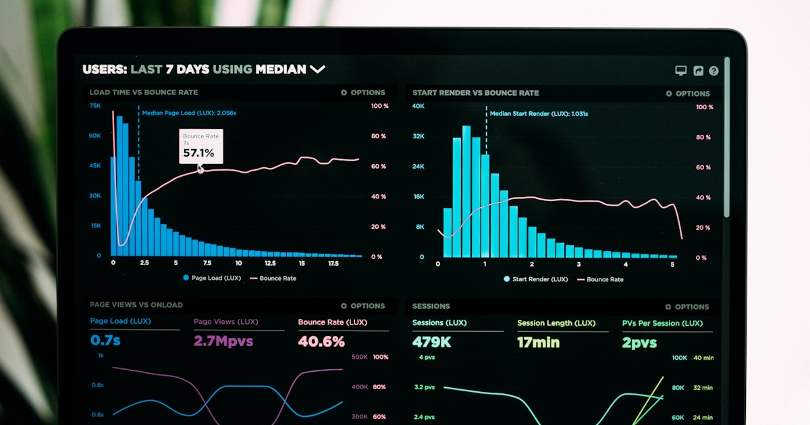

CelestialDocs uses a clean three-tier system to organize content. Understanding this structure is key to building effective documentation.

## The Three Tiers

### Tier 1: Entries (Pages)

The foundation—individual Markdown or MDX files representing one page.

```
Entry
├── One file = One page
├── E.g., guides/installation.md
├── Becomes URL: /docs/guides/installation
└── Shows in sidebar as a clickable link
```

### Tier 2: Groups (Collections)

Collections of related entries organized into sidebar sections.

```
Group: "Getting Started"
├── Collapsible sidebar section
├── Contains multiple entries
├── Examples: Guides, Tutorials, Concepts
└── Can contain other groups (nested)
```

### Tier 3: Tabs (Contexts)

Top-level navigation that switches the entire sidebar context.

```
Tab: "API Reference"
├── Appears at top of sidebar
├── Can be clicked to switch navigation context
├── Contains multiple groups
└── Perfect for separating major sections
```

## Hierarchy Visualization

```
┌─────────────────────────────────────────────────────────────┐
│                     Web Browser                              │
│                                                              │
│  [Learn] [Getting Started] [API Reference] [Guides]         │
│  ↑ Tabs                                                       │
│                                                              │
│  ┌──────────────────────────────────────────────────────┐  │
│  │ Sidebar (current tab: "Getting Started")             │  │
│  │                                                      │  │
│  │  📚 Getting Started (Group)                         │  │
│  │    ├── Installation (Entry) <- clickable link       │  │
│  │    ├── Quick Start (Entry) <- clickable link        │  │
│  │    └── Configuration (Entry) <- clickable link      │  │
│  │                                                      │  │
│  │  🔗 Related Sections (Group)                        │  │
│  │    ├── FAQ (Entry)                                  │  │
│  │    └── Troubleshooting (Entry)                      │  │
│  │                                                      │  │
│  └──────────────────────────────────────────────────────┘  │
│                                                              │
│  (When user clicks "API Reference" tab, entire sidebar     │
│   switches to show that tab's groups and entries)          │
└─────────────────────────────────────────────────────────────┘
```

## How They Connect

### File System -> Configuration -> UI

```
Step 1: File System
    content/my-docs/
    ├── getting-started/
    │   ├── introduction.md        (File)
    │   ├── installation.md        (File)
    │   └── quick-start.md         (File)
    └── api/
        ├── endpoints.md           (File)
        └── authentication.md      (File)

            ↓ (Configuration connects files to groups)

Step 2: Configuration (data/config.ts)
    groups: [
        {
            id: "getting-started",
            label: "Getting Started",
            autoGenerated: true,  <- Discovers files from folder
        },
        {
            id: "api",
            label: "API Reference",
            tab: true,            <- Makes this a tab
            autoGenerated: true,
        },
    ]

            ↓ (System renders configuration as UI)

Step 3: User Interface
    [Learn] [Getting Started] [API Reference]  <- Tabs
         ↓
    📚 Getting Started                    <- Group
    ├── Introduction                      <- Entry
    ├── Installation                      <- Entry
    └── Quick Start                       <- Entry
```

## Full Example: Placing an Entry

Let's trace how a single file becomes a clickable link:

### 1. Create the File

```markdown
# content/my-docs/guides/performance.md

---

title: "Performance Optimization"
description: "Tips for optimizing your system"

---

# Performance Optimization

Content about performance...
```

### 2. Register the Collection

```typescript
// data/config.ts
export const CONTENT = {
    systems: [
        {
            id: "my-docs",
            dir: "content/my-docs",
            route: "/my-docs",
        },
    ],
};
```

### 3. Configure the Group

```typescript
// data/config.ts
export const SIDEBAR_NAVIGATION = {
    "my-docs": {
        defaultTab: { label: "Docs", icon: "📖" },
        groups: [
            {
                id: "guides",
                label: "User Guides",
                autoGenerated: true, // Scans content/my-docs/guides/
            },
        ],
    },
};
```

### 4. Result

- **File:** `content/my-docs/guides/performance.md`
- **Slug:** `guides/performance`
- **URL:** `https://yourdocs.com/my-docs/guides/performance`
- **Sidebar:** Shows "Performance Optimization" under "User Guides" group
- **Navigation:** Clickable link that users can click to read the page

## Scaling the Hierarchy

The three-tier system scales beautifully:

### Small Documentation (10-50 pages)

```
└── Default Tab
    └── Single Group (auto-generated)
        ├── Entry 1
        ├── Entry 2
        └── Entry 3
```

### Medium Documentation (50-200 pages)

```
└── Default Tab
    ├── Group 1 (Getting Started)
    ├── Group 2 (Features)
    └── Group 3 (Advanced)
```

### Large Documentation (200-1000 pages)

```
├── Tab 1: User Guide
│   ├── Group 1: Getting Started
│   ├── Group 2: Features
│   │   ├── Subgroup A
│   │   └── Subgroup B
│   └── Group 3: Advanced
├── Tab 2: API Reference
│   ├── Group 1: Endpoints
│   ├── Group 2: Authentication
│   └── Group 3: Webhooks
└── Tab 3: Patterns & Examples
    └── Group 1: Common Patterns (auto-generated)
```

### Enterprise Documentation (1000+ pages)

```
├── Tab 1: Getting Started
├── Tab 2: User Documentation
│   ├── Group: Basics
│   ├── Group: Intermediate
│   │   ├── Subgroup: Configuration
│   │   └── Subgroup: Deployment
│   └── Group: Advanced
│       ├── Subgroup: Performance
│       ├── Subgroup: Security
│       └── Subgroup: Architecture
├── Tab 3: API Reference
│   ├── Group: v1 (Legacy)
│   └── Group: v2 (Current)
│       ├── Subgroup: Authentication
│       ├── Subgroup: Endpoints
│       └── Subgroup: Webhooks
└── Tab 4: Help & Support
```

## Key Principles

1. **Entries are leaves** - They're always at the bottom; you can't put groups inside entries
2. **Groups are organizational** - They exist to group entries logically
3. **Tabs are contextual** - They switch entire navigation experiences
4. **Nesting has limits** - 3-4 levels is usually optimal; more gets confusing
5. **Structure mirrors files** - Your folder structure should match your navigation

## Next Steps

Now understand the visual representation:

- [Visual Guide](/docs/navigation-system/hierarchy/visual-guide)
- [Real-World Examples](/docs/navigation-system/hierarchy/real-world-examples)

Or learn to configure:

- [Configuration Basics](/docs/configuration/basics/sidebar-structure)
